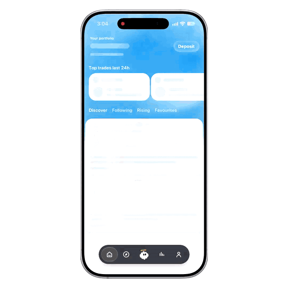
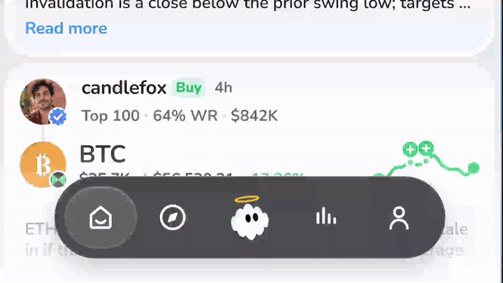
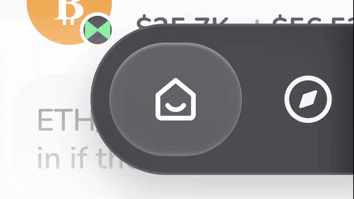
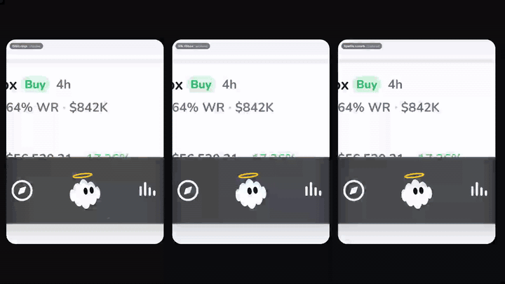
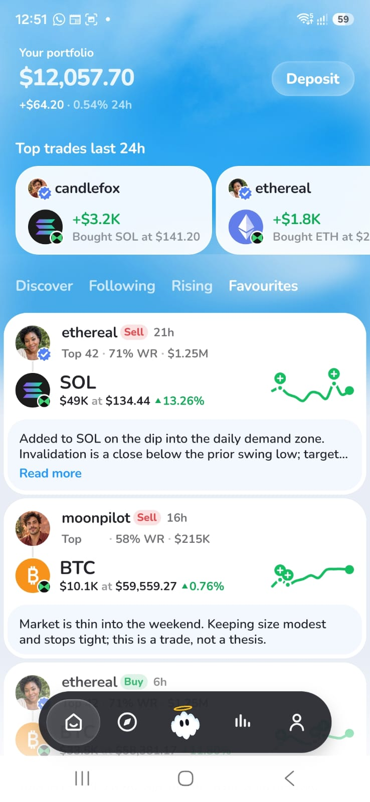

# Miracle Discover

The Discover feed from the Miracle take-home, rebuilt in Expo SDK 57 + TypeScript. Reanimated 4, FlashList, SVG. Mock data.

<p align="center">
  <a href="assets/readme-assets/hero.mp4"></a>
</p>

```bash
npm ci
npm start
```

## How I approached it

**1. Figma first, pixel perfect at every level.** Before any motion I rebuilt the screen 1:1: spacing, type scale, radii, colours, the cloud header, the badges. The file was view-only, so I measured from lossless captures and later from the frame's SVG, then checked at 6x. SF Pro Rounded on iOS through the system rounded font; Nunito on Android and web.

**2. The nav bar.** The glass isn't Liquid Glass. It's a custom material built from the Figma's own values: fill, inner shadow and rim highlights, so it renders the same on Android and iOS (iOS adds a real blur behind it). I tried the native Liquid Glass API first and dropped it because the two platforms didn't match. The pill animation is quick and snappy on purpose: it stretches along its travel and lands critically damped, no bounce. You can drag it too; the ghost follows it with its eyes and you get a haptic tick at each tab.

**3. The ghost.** The mascot is the surprise. It breathes, blinks and glances around on its own, and turns its head toward whichever tab you pick. Tap it and it does a pirouette with comet trails and a dizzy face. Every fourth tap is a rare one: a crouch, a double spin, and coloured orbit rings that burst into sparkles. It fires on a tap, not a hold, because your finger would be covering it.

<p align="center">
  <a href="assets/readme-assets/nav.mp4"></a>
  <br/>
  <a href="assets/readme-assets/nav-slowmo.mp4"></a>
  <br/>
  <a href="assets/readme-assets/rare-animations-prototype.mp4"></a>
</p>

**4. Make the cards easier to read.** The nav bar scales down and sinks as you scroll, and grows back when you scroll up or reach the top. Less chrome over the feed while you're reading it.

**5. The dynamic header.** Scrolling down hides the portfolio header and the tab row. Scrolling up brings back a thin bar with just two things: Deposit, because that's the CTA of this screen, and the feed picker, because that's how you explore. The four tabs fold into a single "Discover ⌄" dropdown, and you can drag across it to pick. Everything else stays hidden until you're back at the top.

**6. Card animations that work together.** A tab switch softens the cards from the tap itself, on the UI thread (slight blur, 0.96 scale, fade), then the new cards land in the same recycled cells and sharpen in, three of them 45 ms apart. The blur stops at the card's rim and the white shell stays solid, so cards never turn into frosted panes over the sky. Other feeds load in the background after the first one, so a switch never shows a skeleton. Sparklines draw in once and markers pop as the line reaches them. Loading is a skeleton with one subtle light sweep. I tried a slide, a pager and a changed-cards-only switch before settling on this.

Deliberately not animated: the portfolio numbers. I built a count-up on mount and removed it. It fought with the skeleton reveal, and without real prices it's decoration.

**7. Android.** Same screen on a Samsung phone. No blur, so the glass and the tab switch fall back to denser fills and scale + fade, and the layout holds across safe areas and widths down to 320 pt.

<p align="center">
  
</p>

## Trade-offs

- Android has no blur: denser fills, and scale + fade on the tab switch.

## Next

- Live number animation on the portfolio and prices, driven by real data.

`npm run typecheck`, `npm run lint`, `npm test`: 182 tests in 25 suites, all passing. There's a dev-only Dials panel for tuning the animations live (`SHOW_DIALS` in App.tsx) and a `/craft.html` page on the web build that I used to record the close-ups.
